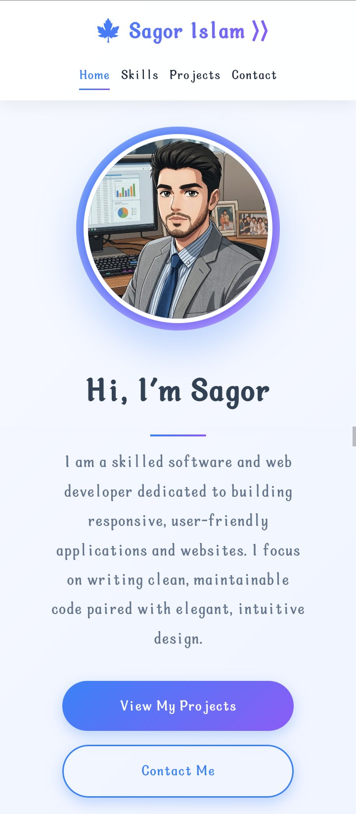

<div align="center">

# 💻 SAGOR ISLAM | PORTFOLIO

### *App & Web Developer*

[](https://sagorxzx.github.io/my_portfolio)
[](https://github.com/sagorxzx/my_portfolio)

</div>

<br>

<div align="center">
  <a href="https://sagorxzx.github.io/my_portfolio">
    
  </a>
</div>

<br>

---

## ✨ **OVERVIEW**

> **A modern, responsive developer portfolio website** showcasing my skills, projects, and professional journey as a Full Stack Developer.

This portfolio represents my expertise in **frontend development** with a focus on creating immersive user experiences. Built from scratch with pure HTML5, CSS3, and JavaScript — no frameworks, just clean, maintainable code.

<div align="center">

| 🎨 **Design** | ⚡ **Performance** | 📱 **Responsive** | 🔧 **Interactive** |
|---------------|--------------------|-------------------|--------------------|
| Modern UI/UX | Fast loading | Mobile-first | Smooth animations |
| Glassmorphism | Optimized assets | All devices | Tilt effects |

</div>

---

## 🔥 **KEY FEATURES**

<div align="center">

| Feature | Description |
|---------|-------------|
| 🎯 **Hero Section** | Animated profile image + typing text effect |
| 📊 **Skills Showcase** | 3 category cards with animated skill lists |
| 🚀 **Projects Gallery** | 3 featured projects with hover effects |
| 📧 **Contact Section** | 4 contact cards with 3D tilt effect |
| 📈 **Progress Bar** | Visual scroll indicator at top |
| 🔝 **Back to Top** | Floating button appears on scroll |
| 🧭 **Smart Navigation** | Active link highlighting on scroll |
| ✨ **Scroll Animations** | Elements fade in as you scroll |

</div>

---

## 🛠️ **TECH STACK**

<div align="center">

### Frontend Core


### Tools & Deployment


</div>

---

## 📂 **FILE STRUCTURE**

```bash
my_portfolio/
│
├── 📄 index.html          # Main HTML structure
├── 🎨 style.css           # All styles & animations
├── ⚙️ script.js           # Interactive functionality
├── 🖼️ profile_image.png   # Profile picture
├── 📸 screenshot.png      # Live preview image
└── 📖 README.md           # Documentation
